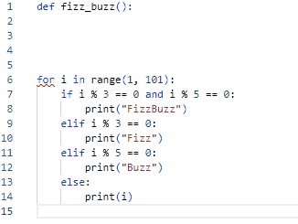

# Python Paste Pro

**Python Paste Pro** is a Visual Studio Code extension that enhances paste and cut operations in Python files by ensuring proper indentation based on context.

## Features

- **Smart Paste**: Automatically adjusts the indentation of pasted code to align with the cursor's context or selected text. It preserves relative indentation when present and attempts to reconstruct it when lost.
- **Smart Cut**: Cuts selected text and, if the cut ends with a colon (e.g., `if condition:`), dedents the subsequent code block to maintain proper structure.
- **Indentation Normalization**: Ensures pasted indentation matches your editor’s settings (tabs vs. spaces) for consistency.
- **Context-Aware Indentation**: Calculates the correct indentation level based on the current or previous line (e.g., increasing indentation after a colon).

## Installation

To install **Python Paste Pro**, follow these steps:

1. Open Visual Studio Code.
2. Navigate to the Extensions view (`Ctrl+Shift+X` or `Cmd+Shift+X` on macOS).
3. Search for "Python Paste Pro".
4. Click **Install** to add it to your VSCode environment.

Alternatively, download the `.vsix` file from the [VSCode Marketplace](https://marketplace.visualstudio.com/items?itemName=00.python-paste-pro) and install it manually.

## Usage

### Smart Paste

1. Copy a Python code snippet to your clipboard.
2. Position your cursor in a Python file or select text to replace.
3. Press `Ctrl+V` (or `Cmd+V` on macOS), and the extension will adjust the pasted code’s indentation automatically.

- **Preserved Indentation**: If the snippet has indentation, it’s adjusted relative to the cursor’s base level.
- **Reconstructed Indentation**: If indentation is lost (e.g., `def func():\npass`), the extension indents based on code structure (e.g., after colons).

### Smart Cut

1. Select text in a Python file.
2. Press `Ctrl+X` (or `Cmd+X` on macOS).
3. If the cut text ends with a colon (e.g., `for item in list:`), the following block is dedented to maintain proper formatting.

## Commands

The extension hooks into standard VSCode commands for Python files:

- **`pythonPastePro.paste`**: Triggers the smart paste feature.
- **`pythonPastePro.cut`**: Triggers the smart cut feature.

These are automatically activated with `Ctrl+V`/`Ctrl+X` (or macOS equivalents) in `.py` files.

## Limitations

- **Indentation Reconstruction**: For code with lost indentation, the extension uses simple rules (e.g., indenting after colons). Complex cases (nested blocks, multi-line statements) might require manual tweaks.
- **Performance**: Optimized for small to medium snippets; very large code blocks may cause a slight delay.
- **Language Scope**: Works only with Python files and does not affect other languages.

## Contributing

Found a bug or have an idea? Please [open an issue](https://github.com/lmmtrr/python-paste-pro/issues) on GitHub. Pull requests are also welcome!

## License

This extension is released under the [MIT License](https://github.com/lmmtrr/python-paste-pro/blob/main/LICENSE).
